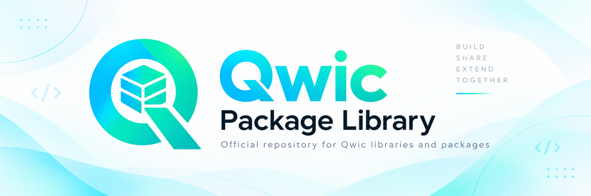

# 📦 Qwic Package Hub

Welcome to the official package hub for the **Qwic Language**. This repository hosts a collection of reusable packages and libraries built strictly in Qwic.

## 🚀 Getting Started

Explore the available packages and integrate them into your Qwic projects to accelerate your development.

## 🛠️ Development

Packages in this hub are built using the Qwic language. For detailed information on the language specifications and build process, refer to the core [QwicLang repository](../../qwiclang).

## 🤝 Contributing

Contributions are welcome! Please ensure that all packages are written in Qwic and follow the project's build guidelines.
